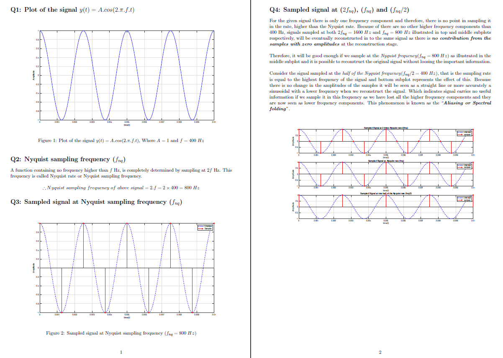

## Content [[pdf]](https://nbviewer.jupyter.org/github/bimalka98/Digital-Signal-Processing/blob/main/Digital%20Signal%20Sampling%20May%203%2C%202021/LaTeX%20Report/180631J_A01_EN2073.pdf) [[code]](code.mlx)

1. Plot of the signal y(t) = A:cos(2:pi:f:t)
2. Nyquist sampling frequency (fnq)
3. Sampled signal at Nyquist sampling frequency (fnq)
4. Sampled signal at (2fnq), (fnq) and (fnq/2)
5. Minimum number of bits (nb) required per a sample and number of minimum quantization levels (L) to have a SNqR ratio greater than 25dB
6. Quantization of Sampled output values [[code]](LaTeX%20Report/code/quantizeSample.m)
7. Quantization of the Signal sampled at 8 times Nyquist rate (8fnq) with 16 Quantization Levels
8. Quantization of the Signal sampled at 8 times Nyquist rate (8fnq) with 32 and 8 Quantization Levels

