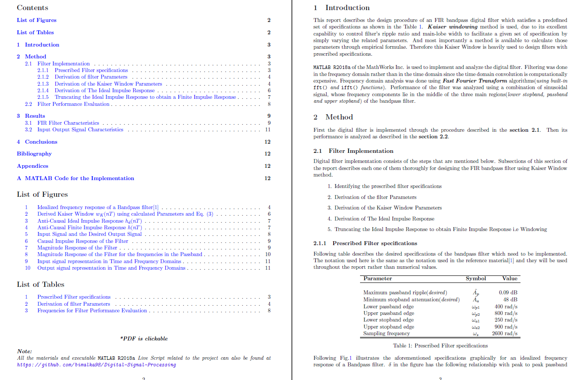

## Design of a Finite Duration Impulse Response Bandpass Digital Filter

> For Prescribed Specifications Using the windowing method in conjunction with the Kaiser window

Design procedure of a Finite Duration Impulse Response(FIR) bandpass Digital Filter which satisfies
a set of prescribed specifications, is described in this report where windowing method in conjunction
with the Kaiser window is used for the designing procedure. Operation of the filter was analyzed with a
combination of sinusoidal signals. The design was implemented and tested using `MATLAB R2018a` of the
MathWorks Inc.

